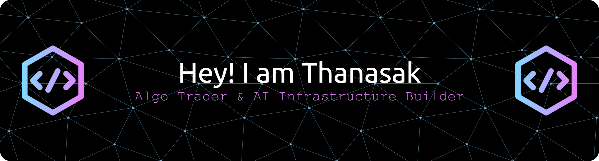

<div align="center">




</div>

## Hi  I'm Thanasak

### 🏴‍☠️ Algo Trader & AI Infrastructure Builder

> *Forex algo trader focused on XAUUSD. Building AI-powered trading systems with multi-agent pipelines.*
> *I architect infrastructure that connects MetaTrader 5, FastAPI, and LLM agents to make smarter trading decisions.*
> *Founder of **Ambside Team** — where AI meets the gold market.* ⚡

<br>

### 🧭 About Me

- 🌍 Based in **Bangkok, Thailand**
- 🖥️ Portfolio at **[Ambside Team](https://github.com/ohfxtrader)**
- 🚀 Currently building **[Ambside AI Brain](https://github.com/ohfxtrader/ambside-ai-brain)** — Multi-Agent AI Trading System
- 🧠 Learning **Multi-Agent AI Systems & LLM Orchestration**
- 🤝 Open to collaborating on **AI Trading Systems, MQL5 Expert Advisors, OpenClaw Agents**

<br>

### 🏗️ What I Build

```
┌─────────────────────────────────────────────────────────┐
│              🧠 AI-Powered Trading Systems              │
│                                                         │
│   📊 Market Data ──→ 🤖 AI Analysis ──→ 📡 Execution   │
│                                                         │
│   • Multi-Agent AI Pipeline                             │
│   • Real-time WebSocket Signal Broadcasting             │
│   • MetaTrader 5 Expert Advisors (MQL5)                 │
│   • Automated Risk Management                           │
│   • Scalable to 100+ trading clients                    │
└─────────────────────────────────────────────────────────┘
```

<br>

### 🛠️ Tech Stack

<div align="center">

**Languages & Core**

<p>
&nbsp;
&nbsp;
&nbsp;
&nbsp;
&nbsp;
&nbsp;
</p>

**Backend & Database**

<p>
&nbsp;
&nbsp;
&nbsp;
&nbsp;
&nbsp;
&nbsp;
</p>

**Frontend & Tools**

<p>
&nbsp;
&nbsp;
&nbsp;
&nbsp;
&nbsp;
</p>

**DevOps & Infra**

<p>
&nbsp;
&nbsp;
&nbsp;
&nbsp;
&nbsp;
</p>

</div>

<br>

<br>

### 🤝 Connect & Support

<div align="center">

<a href="https://www.github.com/ohfxtrader" target="_blank" rel="noreferrer">
<picture>
<source media="(prefers-color-scheme: dark)" srcset="https://raw.githubusercontent.com/danielcranney/readme-generator/main/public/icons/socials/github-dark.svg" />
<source media="(prefers-color-scheme: light)" srcset="https://raw.githubusercontent.com/danielcranney/readme-generator/main/public/icons/socials/github.svg" />

</picture>
</a>

<br><br>

<a href="https://www.buymeacoffee.com/ohthanasak"></a>&nbsp;&nbsp;
<a href="https://www.ko-fi.com/ohthanasak"></a>

</div>

<br>

<div align="center">


*"Powered by mass☕ caffeine and mass📉 drawdown. Still holding. Still coding."* 🏴‍☠️

</div>
